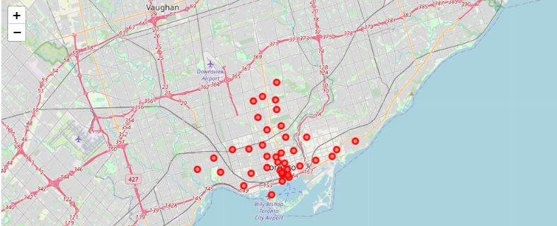
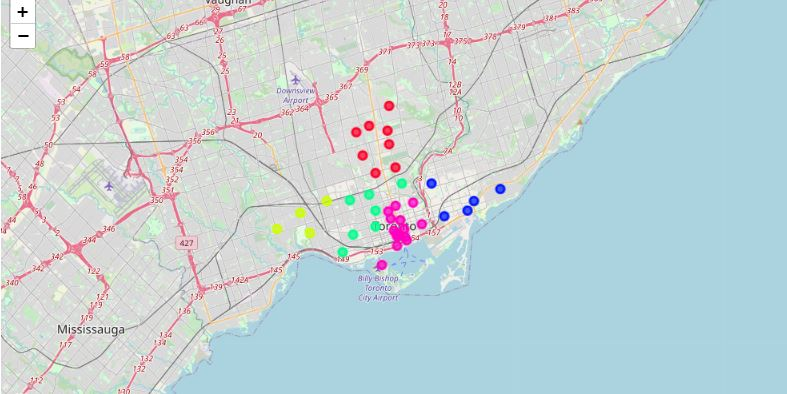

# Segmenting and Clustering Neighborhoods in Toronto

This repository is created as a part of the IBM Applied Data Science Capstone - Week 3 Project, on Coursera. The Objective of this project is to explore, segment, and cluster the neighborhoods in the city of Toronto using K Means Clustering algorithm. To do so, we use the Foursquare API to explore neighborhoods in Toronto. We then use the explore function to get the most common venue categories in each neighborhood, and then use this feature to group the neighborhoods into clusters. We then use the k-means clustering algorithm to complete this task. Finally, we use the Folium library to visualize the neighborhoods in Toronto and their emerging clusters.

The first map contains the visualization of the various neighbourhoods in Toronto, Canada.

The second map contains the clusters of neighbourhoods of Toronto, basis the most common venue categories fetched using FourSquare API

